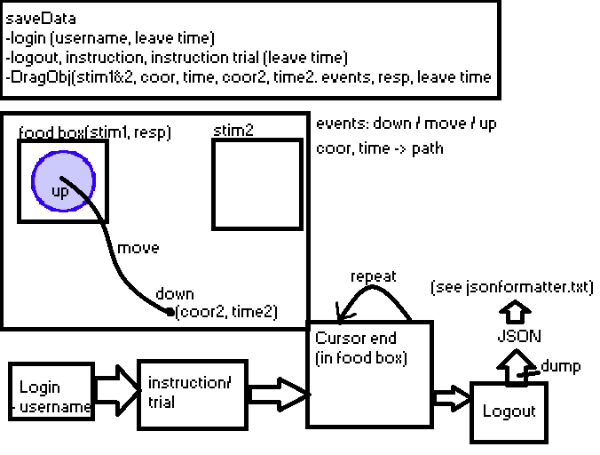

# Mousetrack
Mouse tracking app with [python 2.7.18](https://www.python.org/downloads/release/python-2718/) and [kivi](https://kivy.org/doc/stable/gettingstarted/installation.html#install-pip).

## Final data
To check final data paste it in [JSON formatter](https://jsonformatter.org/). Or check [jsonformatter.txt](jsonformatter.txt) for example.

### infographic

## Todo
* save: response_name, recommendation, trial_type(control, text, position)
* Chao: data parse script
